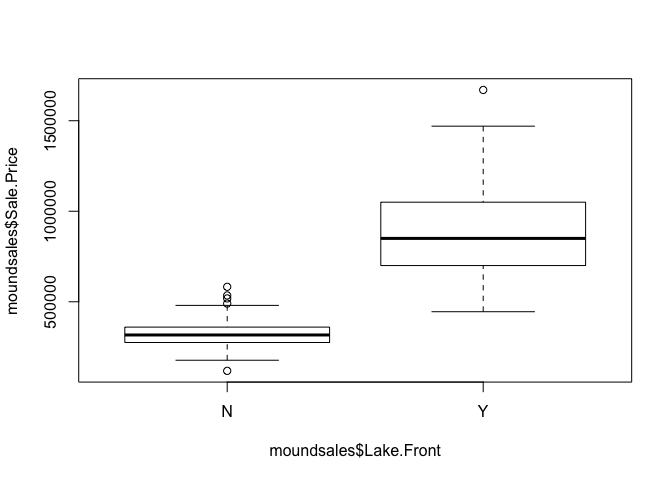
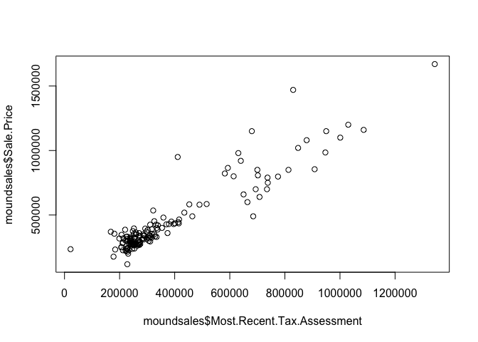
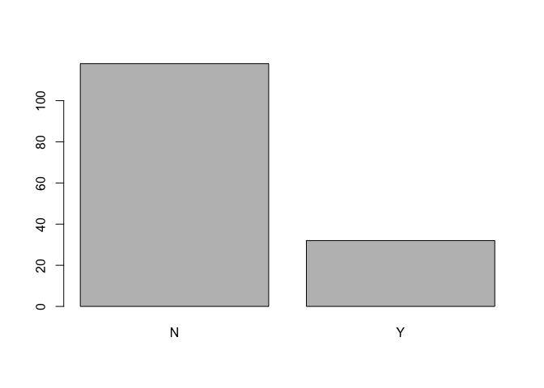

# Intro

## What:

For my final project, I analyzed Zillow home sales data for Mound, MN
over the past two years, specially focusing on 3 bedroom, 2+ bathroom
houses.

## Why:

I have a rental house in Mound, MN that I’m planning to put on the
market in June and I’m interested to see if the past home sales data
will reflect any interesting trends or help me predict the final sale
price of my house.

## How:

I started by manually curating a data frame (‘moundsales’) from Zillow
[(Data
Source)](https://www.zillow.com/mound-mn/sold/house_type/3-3_beds/2.0-_baths/3_p/?searchQueryState=%7B%22pagination%22%3A%7B%22currentPage%22%3A3%7D%2C%22usersSearchTerm%22%3A%22Mound%2C%20MN%22%2C%22mapBounds%22%3A%7B%22west%22%3A-93.75159852978517%2C%22east%22%3A-93.56963747021486%2C%22south%22%3A44.87695033358592%2C%22north%22%3A44.992152656806155%7D%2C%22mapZoom%22%3A12%2C%22regionSelection%22%3A%5B%7B%22regionId%22%3A26000%2C%22regionType%22%3A6%7D%5D%2C%22isMapVisible%22%3Atrue%2C%22filterState%22%3A%7B%22beds%22%3A%7B%22max%22%3A3%2C%22min%22%3A3%7D%2C%22baths%22%3A%7B%22min%22%3A2%7D%2C%22con%22%3A%7B%22value%22%3Afalse%7D%2C%22fore%22%3A%7B%22value%22%3Afalse%7D%2C%22apa%22%3A%7B%22value%22%3Afalse%7D%2C%22mf%22%3A%7B%22value%22%3Afalse%7D%2C%22ah%22%3A%7B%22value%22%3Atrue%7D%2C%22sort%22%3A%7B%22value%22%3A%22globalrelevanceex%22%7D%2C%22nc%22%3A%7B%22value%22%3Afalse%7D%2C%22rs%22%3A%7B%22value%22%3Atrue%7D%2C%22land%22%3A%7B%22value%22%3Afalse%7D%2C%22tow%22%3A%7B%22value%22%3Afalse%7D%2C%22manu%22%3A%7B%22value%22%3Afalse%7D%2C%22cmsn%22%3A%7B%22value%22%3Afalse%7D%2C%22apco%22%3A%7B%22value%22%3Afalse%7D%2C%22fsba%22%3A%7B%22value%22%3Afalse%7D%7D%2C%22isListVisible%22%3Atrue%7D).

The data frame includes 150 instances and 12 variables: ‘ID’, ‘Address’,
‘Beds’, ‘Baths’, ‘SQFT’, ‘Month.Sold’, ‘Year.Sold’, ‘Sale.Price’,
‘Lake.Front’, ‘Year.Built’, ‘Lot.Size.Sqft’,
‘Most.Recent.Tax.Assessment’.

I conducted exploratory data analysis of the data frame, created new
data subsets, summarized data via histogram, scatter and box plots,
determined probability, determined mean/standard deviation/z-score, and
conducted regression.

# Body

According to Zillow, the were 150 three bedroom, two-plus bathroom
houses sold in Mound, MN between April 2020 and April 2022. Mound is a
community on Lake Minnetonka, therefore 32 of the 150 houses are lake
front properties. This is an important distinction because these houses
sold for significantly more than non-lake front houses, usually in the
million dollar range.

My house was built in 1948, has 1859 finished sqft and includes three
bedrooms and two baths. The house sits on a 10,000 sqft, non-lake front,
lot and was assessed at $245,000 in 2021.

I’d like to understand the relationship between sale price and the most
recent tax assessment data and determine the probability of my house
selling for over $300,000.

# Topics From Class

## Topic 1: Data Basics

For this observational study, I created a data frame labeled
‘moundsales’. In addition, I created a subset labeled ‘nonlf’ that only
includes non-lake front houses because including lake front houses skews
the sale price and tax assessment data.

    moundsales <- read.table("moundsales.csv", sep = ",", header = TRUE)

    nonlf <- subset(moundsales, moundsales$Lake.Front == 'N')

I conducted a number of various data exploration activities in R (e.g.,
dim, length, names, summary, head, tail, etc.) to anlayze both the
‘moundsales’ and ‘nonlf’ data frames. See Appendix for more details.

## Topic 2: Summarizing Data

The mean sale price for lake front houses was $888,192, while the mean
sale price for non-lake front houses is $324,801.

    lakefront <- subset(moundsales, moundsales$Lake.Front == 'Y')
    summary(lakefront)

    ##        ID                      Address  
    ##  Min.   :  2.00   1579 Bluebird Ln : 1  
    ##  1st Qu.: 38.50   1721 Eagle Ln    : 1  
    ##  Median : 88.00   1778 Shorewood Ln: 1  
    ##  Mean   : 78.38   1791 Resthaven Ln: 1  
    ##  3rd Qu.:119.75   1969 Lakeside Ln : 1  
    ##  Max.   :150.00   2033 Arbor Ln    : 1  
    ##                   (Other)          :26  
    ##       Beds       Baths            SQFT     
    ##  Min.   :3   Min.   :2.000   Min.   :1302  
    ##  1st Qu.:3   1st Qu.:2.000   1st Qu.:1718  
    ##  Median :3   Median :3.000   Median :2239  
    ##  Mean   :3   Mean   :3.078   Mean   :2316  
    ##  3rd Qu.:3   3rd Qu.:4.000   3rd Qu.:2552  
    ##  Max.   :3   Max.   :5.000   Max.   :4153  
    ##                                            
    ##    Month.Sold   Year.Sold      Sale.Price     
    ##  Jul    :8    Min.   :2020   Min.   : 445000  
    ##  Dec    :5    1st Qu.:2020   1st Qu.: 700000  
    ##  Apr    :4    Median :2020   Median : 850000  
    ##  Aug    :4    Mean   :2021   Mean   : 888192  
    ##  Mar    :3    3rd Qu.:2021   3rd Qu.:1035000  
    ##  Nov    :2    Max.   :2022   Max.   :1670000  
    ##  (Other):6                                    
    ##  Lake.Front   Year.Built   Lot.Size.Sqft  
    ##  N: 0       Min.   :1910   Min.   : 4356  
    ##  Y:32       1st Qu.:1946   1st Qu.: 7840  
    ##             Median :1972   Median : 9583  
    ##             Mean   :1968   Mean   :10911  
    ##             3rd Qu.:1990   3rd Qu.:12306  
    ##             Max.   :2020   Max.   :28750  
    ##                                           
    ##  Most.Recent.Tax.Assessment
    ##  Min.   : 411000           
    ##  1st Qu.: 637750           
    ##  Median : 705000           
    ##  Mean   : 749812           
    ##  3rd Qu.: 855750           
    ##  Max.   :1344000           
    ## 

    boxplot(moundsales$Sale.Price ~ moundsales$Lake.Front)

Only 46 houses, or 39%, sold for under $300,000, which supports my
realator’s claim that there has been a shortage of houses under $300,000
for sale in Mound, MN.

    under300k <- subset(nonlf, nonlf$Sale.Price < 300000)
    dim(under300k)

    ## [1] 46 12

Of the 46 houses that sold for more than $300,000, 16 had a recent tax
assessment of $245,000 or below.

    S300kT245 <- subset(nonlf, nonlf$Sale.Price > 300000 & nonlf$Most.Recent.Tax.Assessment < 246000)
    dim(S300kT245)

    ## [1] 16 12

## Topic 3: Probability

The probability of a three bedroom, two-plus bathroom house in Mound, MN
selling for $300,000 or more given it is not lake front is 61%.

    Over299k <- subset(nonlf, nonlf$Sale.Price > 299999)
    72/118

    ## [1] 0.6101695

The probability of a three bedroom, two-plus bathroom house in Mound, MN
selling for $1 million or more given it has lake front is 28%.

    table(moundsales$Lake.Front)

    ## 
    ##   N   Y 
    ## 118  32

    milsale <- subset(moundsales, moundsales$Sale.Price > 999999)
    View(milsale)

    9/32

    ## [1] 0.28125

## Topic 4: Normal Distribution

The sale price distribution for the ‘nonlf’ data set is unimodal and
normal with a slight skew to the right. The distribution has the
following statistics:

mean = 324801 sd = 74870 x = 300000 Z-score = - .331

There is a 63% probability that my house will sell for over $300k.

    format(nonlf$Sale.Price, scientific = FALSE)

    ##   [1] "341000" "346000" "330000" "315000" "322000"
    ##   [6] "318000" "360000" "427900" "315000" "535000"
    ##  [11] "299251" "400000" "273000" "280000" "350000"
    ##  [16] "118400" "290000" "302000" "335000" "302000"
    ##  [21] "490000" "300000" "386000" "310000" "250000"
    ##  [26] "430000" "370000" "387500" "365000" "295000"
    ##  [31] "385000" "320000" "292000" "452061" "425000"
    ##  [36] "395000" "287000" "582500" "425000" "330000"
    ##  [41] "232500" "375000" "310000" "300000" "480000"
    ##  [46] "305000" "518500" "350000" "342500" "355000"
    ##  [51] "333000" "354000" "320000" "420000" "396000"
    ##  [56] "340000" "339900" "290000" "271900" "320000"
    ##  [61] "312999" "215000" "281500" "355000" "370000"
    ##  [66] "325000" "435000" "305000" "360000" "289500"
    ##  [71] "449051" "280000" "325000" "240000" "235000"
    ##  [76] "400000" "390000" "300000" "250000" "465000"
    ##  [81] "237000" "279000" "177000" "265000" "271000"
    ##  [86] "350000" "270000" "320678" "270000" "272500"
    ##  [91] "275000" "268000" "339000" "200000" "262000"
    ##  [96] "281685" "315000" "350000" "278900" "275000"
    ## [101] "435000" "225000" "319000" "236400" "335000"
    ## [106] "245000" "265000" "430000" "270000" "226600"
    ## [111] "295000" "240000" "275000" "289900" "228000"
    ## [116] "330000" "329900" "222000"

    hist(nonlf$Sale.Price)

    sd(nonlf$Sale.Price)

    ## [1] 74870.19

Given:

mean = 324801 sd = 74870 x = 300000

    (300000 - 324801)/74870

    ## [1] -0.3312542

Answer: z-score = - .331

    1 - pnorm(-.331)

    ## [1] 0.6296778

Answer: 63%

## Topic 5: Regression

According to the regression data below, there is a very high correlation
between the ‘Sale.Price’ and ‘Most.Recent.Tax.Assessment’ data. The
intercept value indicates that one could expect a house to sell for a
premium of $20,934 over the most recent tax assessment for the house.

    plot(moundsales$Sale.Price ~ moundsales$Most.Recent.Tax.Assessment)

    lm(moundsales$Sale.Price ~ moundsales$Most.Recent.Tax.Assessment)

    ## 
    ## Call:
    ## lm(formula = moundsales$Sale.Price ~ moundsales$Most.Recent.Tax.Assessment)
    ## 
    ## Coefficients:
    ##                           (Intercept)  
    ##                             20934.465  
    ## moundsales$Most.Recent.Tax.Assessment  
    ##                                 1.131

    summary(lm(moundsales$Sale.Price ~ moundsales$Most.Recent.Tax.Assessment))

    ## 
    ## Call:
    ## lm(formula = moundsales$Sale.Price ~ moundsales$Most.Recent.Tax.Assessment)
    ## 
    ## Residuals:
    ##     Min      1Q  Median      3Q     Max 
    ## -305751  -44941  -16431   30781  510236 
    ## 
    ## Coefficients:
    ##                                        Estimate
    ## (Intercept)                           2.093e+04
    ## moundsales$Most.Recent.Tax.Assessment 1.131e+00
    ##                                       Std. Error
    ## (Intercept)                            1.560e+04
    ## moundsales$Most.Recent.Tax.Assessment  3.580e-02
    ##                                       t value
    ## (Intercept)                             1.342
    ## moundsales$Most.Recent.Tax.Assessment  31.596
    ##                                       Pr(>|t|)
    ## (Intercept)                              0.182
    ## moundsales$Most.Recent.Tax.Assessment   <2e-16
    ##                                          
    ## (Intercept)                              
    ## moundsales$Most.Recent.Tax.Assessment ***
    ## ---
    ## Signif. codes:  
    ## 0 '***' 0.001 '**' 0.01 '*' 0.05 '.' 0.1 ' ' 1
    ## 
    ## Residual standard error: 97490 on 148 degrees of freedom
    ## Multiple R-squared:  0.8709, Adjusted R-squared:   0.87 
    ## F-statistic: 998.3 on 1 and 148 DF,  p-value: < 2.2e-16

# Conclusion

In conclusion, I determined that there is a very high correlation
between sale price and the most recent tax assessment for 3 bedroom, 2+
bath houses sold in Mound, MN in the past two years. During this time,
72 non-lake front houses were sold for $300,000 or more and there is a
63% probability that my house will sell for $300,000 or more. As a side
note, I also learned that if my property were to have lake front, there
would be a 28% probability of selling my property for $1 million or
more!

# APPENDIX

### ‘moundsales’ Data Set

    moundsales <- read.table("moundsales.csv", sep = ",", header = TRUE)

    dim(moundsales)

    ## [1] 150  12

    length(dim(moundsales))

    ## [1] 2

    names(moundsales)

    ##  [1] "ID"                        
    ##  [2] "Address"                   
    ##  [3] "Beds"                      
    ##  [4] "Baths"                     
    ##  [5] "SQFT"                      
    ##  [6] "Month.Sold"                
    ##  [7] "Year.Sold"                 
    ##  [8] "Sale.Price"                
    ##  [9] "Lake.Front"                
    ## [10] "Year.Built"                
    ## [11] "Lot.Size.Sqft"             
    ## [12] "Most.Recent.Tax.Assessment"

    head(moundsales)

    ##   ID            Address Beds Baths SQFT
    ## 1  1 4674 Cumberland Rd    3   2.0 2369
    ## 2  2  6641 Halstead Ave    3   3.0 2092
    ## 3  3   4767 Richmond Rd    3   2.0 1500
    ## 4  4 4515 Manchester Rd    3   2.0 1931
    ## 5  5  6117 Beachwood Rd    3   2.5 2400
    ## 6  6     4812 Lanark Rd    3   2.0 2010
    ##   Month.Sold Year.Sold Sale.Price Lake.Front
    ## 1        Apr      2022     341000          N
    ## 2        Apr      2022     980000          Y
    ## 3        Apr      2022     346000          N
    ## 4        Mar      2022     330000          N
    ## 5        Mar      2022     315000          N
    ## 6        Mar      2022     322000          N
    ##   Year.Built Lot.Size.Sqft
    ## 1       1984          6534
    ## 2       1980         10018
    ## 3       1981          5662
    ## 4       1920          8276
    ## 5       1970         12632
    ## 6       1987          9583
    ##   Most.Recent.Tax.Assessment
    ## 1                     290000
    ## 2                     631000
    ## 3                     207000
    ## 4                     240000
    ## 5                     282000
    ## 6                     256000

    tail(moundsales)

    ##      ID           Address Beds Baths SQFT
    ## 145 145 5736 Lynwood Blvd    3     2 1939
    ## 146 146   4714 Hanover Rd    3     2 1630
    ## 147 147    4959 Leslie Rd    3     3 2729
    ## 148 148    5447 Breezy Rd    3     2 2047
    ## 149 149     2740 Grove Ln    3     2 1426
    ## 150 150   3201 Charles Ln    3     4 2475
    ##     Month.Sold Year.Sold Sale.Price Lake.Front
    ## 145        Apr      2020     289900          N
    ## 146        Apr      2020     228000          N
    ## 147        Apr      2020     330000          N
    ## 148        Apr      2020     329900          N
    ## 149        Apr      2020     222000          N
    ## 150        Apr      2020    1100000          Y
    ##     Year.Built Lot.Size.Sqft
    ## 145       1910         16553
    ## 146       1972          6534
    ## 147       1965         17860
    ## 148       1946         10018
    ## 149       1984         10055
    ## 150       1988         13068
    ##     Most.Recent.Tax.Assessment
    ## 145                     273000
    ## 146                     234000
    ## 147                     334000
    ## 148                     312000
    ## 149                     222000
    ## 150                    1001000

    summary(moundsales$Sale.Price)

    ##    Min. 1st Qu.  Median    Mean 3rd Qu.    Max. 
    ##  118400  287625  337000  444991  451308 1670000

    summary(moundsales$Most.Recent.Tax.Assessment)

    ##    Min. 1st Qu.  Median    Mean 3rd Qu.    Max. 
    ##   22000  241250  278500  374900  399750 1344000

    table(moundsales$Lake.Front)

    ## 
    ##   N   Y 
    ## 118  32

    milsale <- subset(moundsales, moundsales$Sale.Price > 999999)
    View(milsale)

    lakefront <- table(moundsales$Lake.Front)
    barplot(lakefront)

 \#\#\#
‘nonlf’ Data Set

    nonlf <- subset(moundsales, moundsales$Lake.Front == 'N')

    summary(nonlf$Sale.Price)

    ##    Min. 1st Qu.  Median    Mean 3rd Qu.    Max. 
    ##  118400  275000  316500  324801  358750  582500

    summary(nonlf$Most.Recent.Tax.Assessment)

    ##    Min. 1st Qu.  Median    Mean 3rd Qu.    Max. 
    ##   22000  237250  259000  273229  307750  464000

    summary(nonlf$SQFT)

    ##    Min. 1st Qu.  Median    Mean 3rd Qu.    Max. 
    ##    1117    1542    1820    1876    2154    3566

    summary(nonlf$Lot.Size.Sqft)

    ##    Min. 1st Qu.  Median    Mean 3rd Qu.    Max. 
    ##    3484    6534    9583   10029   11761   23522

    summary(nonlf$Year.Built)

    ##    Min. 1st Qu.  Median    Mean 3rd Qu.    Max. 
    ##    1910    1954    1974    1969    1987    2020

    under300k <- subset(nonlf, nonlf$Sale.Price < 300000)
    dim(under300k)

    ## [1] 46 12
